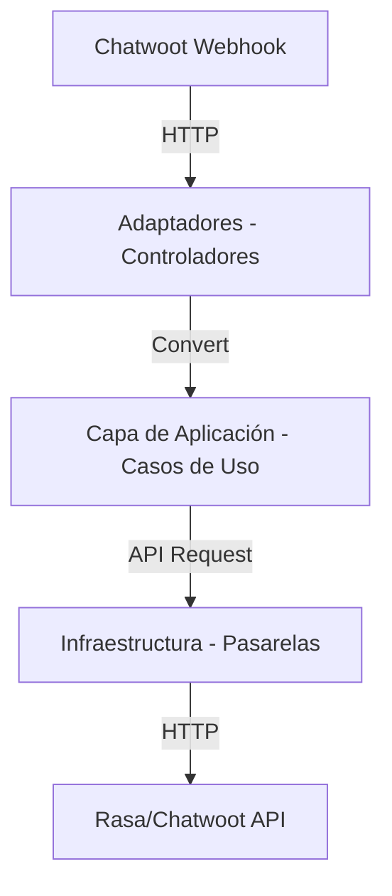

# Diseño de Arquitectura

## 1. Mapeo a Clean Architecture
La arquitectura sigue los principios de Clean Architecture para garantizar la mantenibilidad.

## 2. Estructura de Componentes
| Capa | Carpeta | Responsabilidad |
| :--- | :--- | :--- |
| **Controladores** | `src/adaptadores/controladores/` | Endpoints FastAPI. |
| **Aplicación** | `src/aplicacion/` | Orquestación, flujo del puente. |
| **Pasarelas** | `src/adaptadores/pasarelas/` | Clientes HTTP hacia servicios externos. |
| **Infraestructura** | `src/infraestructura/` | Detalles técnicos (config, http client). |
| **Dominio** | `src/dominio/` | Modelos de datos (Pydantic). |

## 3. Flujo de Datos
1. **Entrada:** `ControladorWebhook` recibe evento -> `Servicio de Aplicación` procesa.
2. **Transformación:** El `Transformer` mapea formatos.
3. **Salida:** `Pasarela` envía mensaje al sistema destino.