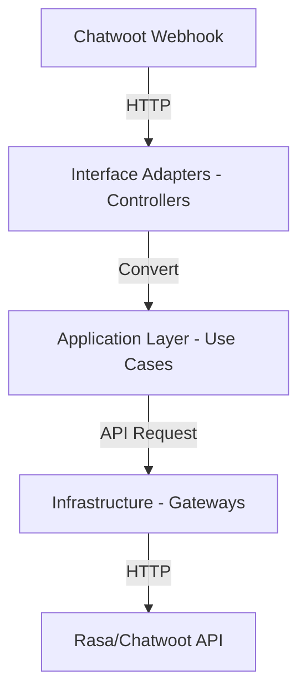

# Diseño de Arquitectura

## 1. Mapeo a Clean Architecture
La arquitectura sigue los principios de Clean Architecture para garantizar la mantenibilidad.

## 2. Estructura de Componentes
| Capa | Carpeta | Responsabilidad |
| :--- | :--- | :--- |
| **Controllers** | `src/interface_adapters/controllers/` | Endpoints FastAPI. |
| **Application** | `src/application/` | Orquestación, flujo del puente. |
| **Gateways** | `src/interface_adapters/gateways/` | Clientes HTTP hacia servicios externos. |
| **Infrastructure** | `src/infrastructure/` | Detalles técnicos (config, http client). |
| **Domain** | `src/domain/` | Modelos de datos (Pydantic). |

## 3. Flujo de Datos
1. **Entrada:** `WebhookController` recibe evento -> `ApplicationService` procesa.
2. **Transformación:** El `Transformer` mapea formatos.
3. **Salida:** `Gateway` envía mensaje al sistema destino.